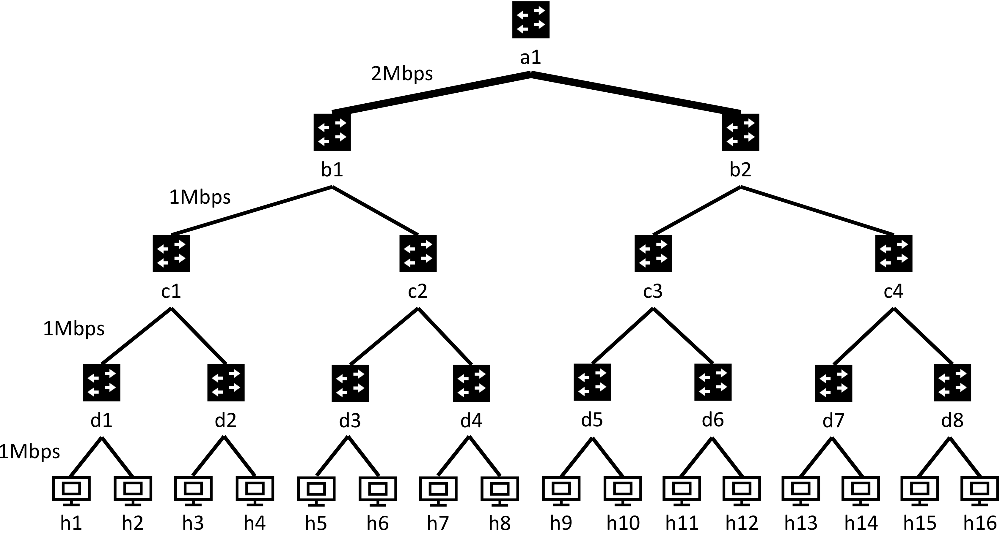
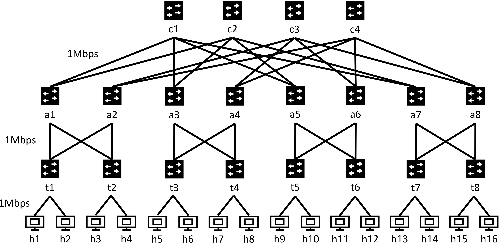

# Project 1: FatTree Topology

## Objectives
* Configure a FatTree topology with basic routing policies.
* Compare application performance (*i.e.,* `iperf`, `memcached`, and video) between FatTree and Binary Tree.

## Getting started

You will work on `project1/` directory.
We will provide you the complete code for building Binary Tree as an example for building FatTree.

## Tutorial: a Binary Tree Topology
We provide example code for an example `I=4` layer Binary Tree topology with 16 hosts, 8 ToR switches, 7 internal switches, and multiple links with different bandwidth.


We now use a python script `topology/topo_bin_gen.py` to create the topology `topology/p4app_bin.json`. For example, to build the Binary Tree topology with `I=4`, you can run
```
python topology/topo_bin_gen.py 4
```
As you can see in `topology/topo_bin_gen.py`, the link bandwidth is specified like `["a1", "b1", {"bw": 2}]`, which means 2Mbit/sec between port `a1` and `b1`. 
Note that the link bandwidth actually translates into the speed of the two ports for that link in mininet (as you can see in the output of mininet: `(2.0Mbit) (2.0Mbit) (a1, b1)`).

Then you can run the Binary Tree topology by: 
```
sudo p4run --config topology/p4app_bin.json
```

Our controller is at `controller/controller_bin.py`. For `I=4`, you can run
```
python controller/controller_bin.py 4
```
You can then test the BinaryTree topology in the same way as your circle and line topologies in Project 0.

### Two optional configuration fields in p4app.json

You might find two configuration fields: `exec_scripts` and `default_bw` convenient to use.

1. `exec_scripts`: it allows you to add scripts that will be automatically called after the topology starts. The scripts will be called in the `root` namespace, not inside any host. 
    For example, by adding 
    ```
        "exec_scripts": [
            {
               "cmd": "python controller/controller_bin.py 4",
               "reboot_run": true
            }
        ],
    ```
    inside the outermost `{}` in `p4app_bin.json`, you don't have to run the controller manually anymore.
    If for debugging reasons you want to start the controller yourself just remove this option (setting `reboot_run` to false does not suffice).

2. `default_bw`: this can be used to set the default bandwidth of all the links in the topology. For example, by adding 
    ```
    "default_bw": 1,
    ```
    inside the `topology` `{}` in `p4app_bin.json`, you set the default link bandwidth to 1Mbps; you can overwrite specific link (eg, `a1-b1`) bandwidth to 2Mbps by writing `["a1", "b1", {"bw": 20}]` inside `links` field under `topology`. Note that a link without any bandwidth setting (ie, no default value and no specific value) will have infinite bandwidth. 


## Your task: Building a FatTree Topology
You will now extend the Binary Tree to a FatTree topology by modifying `topology/topo_fat_gen.py` and `controller/controller_fat_onecore.py`.
Below, we provide detailed steps for creating a FatTree topology with k=4; you solution should work for `k=4, 6, 8`.

### Step One: Create the Topology
You should write a script `topology/topo_fat_gen.py` to generate the topology file. Your script should take *k* as the input and output to `topology/p4app_fat.json`. For example, to generate the FatTree topology with 16 hosts, we will run:
```
python topology/topo_fat_gen.py 4
```

The following figure illustrates an example FatTree topology with `k=4` where `k` is the number of ports each switch has. This FatTree topology contains `16` hosts `h1-h16`, `8` ToR switches `t1-t8`, `8` aggregate switches `a1-a8`, `4` cores switches `c1-c4`, and multiple links with the same bandwidth (*i.e.,*  1Mbps).

**Please make sure you use exactly the same switch and host names as the figure. Otherwise, we cannot test your reachability and you would not get the grades.**
Your generated topology file `topology/p4app_fat.json` should have all link bandwidth set to 1Mbps. (Check how we set link bandwidth previously for Binary Tree.) 

### Step Two: Write the Controller
Now modify `controller/controller_fat_onecore.py` for all the switches. The script should take an input `k`. For example, you can run the following for k=4:
```
python controller/controller_fat_onecore.py 4
```
Your main goal is to enable all-to-all communications in the topology (i.e., the `pingall` command in mininet should succeed).
You can test your solution using ``pingall`` to test the solution. 
Currently, you should **route all the traffic through the first Core switch (*i.e.,* switch c1)**. We will explore routing through multiple switches later. 

**Hint 1:** You need to treat the switches each layer separately. For the switches in each layer, you may install one rule for each host indicating which port it needs to be forwarded.

**Hint 2:** How do you compute the port number for each host without listing them all in an array?

**Hint 3:** In Mininet, switches do not support the same packets coming into and then immediately coming out from the same port. For example, you cannot let a packet goes from h1 to t1, and set rules on t1 to let the packet route back to h1 immediately. Your forwarding rules should avoid this kind of behavior since it will cause failures in `pingall`.

**Hint 4:** For debugging, you may start by testing ping between a pair of hosts before trying out `pingall`.

**Food for thought:** Do you really need one rule for each host?

### Test your code
This is how we will grade your code. We will run the scripts on multiple terminals in the same way as project 0.
```
python topology/topo_fat_gen.py 4
sudo p4run --conf topology/p4app_fat.json
python controller/controller_fat_onecore.py 4
```
Finally, we can run the automatic tests as follows:
```
sudo python3 tests/validate_fat_topo.py 4
```

**You solution should work with `k=4, 6, 8` for FatTree.** We will use scripts to automatically test your code for each of `k`.Your score will be halved if you write specific cases for each of `k`. We will manually check your code to identify this problem. 


## Compare application performance between Binary Tree and FatTree
In the following experiments, you will compare the Binary Tree topology (with `I=4`) and FatTree topology (with `k=4`). 

## Topology configuration
We now try to compare these applications on the two topologies.

In FatTree, the bandwidth is set to **1Mbps**, because the **total capacity of each switch to 4Mbps**.

The question is what is a fair comparison of the two topologies. If we assume Binary Tree topology can only use the same type of switches (i.e., with a total capacity of 4Mbps), we get:

- For the two down links of switch `a1` in Binary Tree, their bandwitdth is set to **2Mbps** (*i.e.*,4Mbps / 2)
- For the four down links of switches `bX`, their bandwidth is set to **1Mbps** (*i.e.*, (4Mbps - 2Mbps) / 2)
- For the eight down links of switches `cX` and the sixteen down links of switches `dX`, we just set them as **1Mbps**

That explains the bandwidth setting in the above topology figures for FatTree and Binary Tree.

## Application isolation with two core switches on FatTree

### Application setting
You let `memcached` send traffic between `h1` and `h9`, and let `iperf` send traffic between `h4` and `h12`. 

You can use the followings commands to generate traffic and run applications. 
```
python ./apps/trace/generate_trace.py --mchost=1,9 --iperfhost=4,12 --length=60 --file=./apps/trace/memcached_iperf.trace
sudo python ./apps/send_traffic.py ./apps/trace/memcached_iperf.trace 1,4,9,12 60
```

### Write a two-core controller
In this experiment, we isolate the traffic of `memcached` and `iperf` applications by routing their traffic to different core switches in FatTree topology. In particular, you need to write a new controller `controller_fat_twocore.py` that routes traffic using two core switches: For ease of grading, you should install rules that routes all traffic to hosts with odd number (i.e., those `dmac` addresses belong to `h1,3,5,7,9,11,13,15`) to core switch `c1`, and all traffic to hosts with even number (i.e., those `dmac` addresses belong to `h2,4,6,8,10,12,14,16`) to core switch `c2`. Given that `memcached` send traffic between `h1` and `h9`, the above rules will direct `memcached` traffic to `c1`. Similarly, `iperf` traffic between `h4` and `h12` goes to `c2`. Your new controller should also make mininet `pingall` succeed (for cases of `k=4, 6, 8`). 

Note that the above routing rules are just for your convenience. In practice, we identify memcached and iperf trraffic based on port numbers and traffic patterns.

After you have finished the new controller for FatTree, you need to run the following experiments (you only need to run these experiments for `k=4` case): 

### Experiments

- (Expr 1) running the application setting on FatTree topology using single core switch
- (Expr 2) running the application setting on FatTree topology using two core switches
- (Expr 3) running the application setting on Binary Tree topology

### Questions
You should answer the following questions in your report.md (see [Submission and Grading](#submission-and-grading))) (just one or two sentences for each question mark):

* What is the performance of memcached under FatTree with two core switches, compared with the memcached under FatTree with only one core switch and memcached under Binary Tree? (Experiments 1, 2, and 3) Why? Please include the screenshots of three memcached latency results. 
* What is the performance of iperf under FatTree with two core switches, compared with the iperf under FatTree with only one core switch and iperf under Binary Tree? (Experiments 1, 2, and 3) Why? Please include the screenshots of three iperf throughput results. 

### Optional experiment (This not extra credit but just for you to have some fun experiments)
What will happen if you replace the `memcached` with the video application used in Project 0 (i.e., running video between `h1` and `h9`)? What would you observe? Why?


## P4 Network Visualizer for Debugging
Daniel Rodrigues who took CS145 last year made this [P4 network Visualizer](https://github.com/Danieltech99/P4-Network-Visualizer) tool as his final project. 
The tool can show the link traffic rate in real time, pretty useful for debugging -- thanks to Daniel. You are free to use this great tool! 

Note that we havn't fully tested the tool. We may not have timely response to fix the problems you face when using this tool. Please file tickets on that github if you face problems.

You will have a chance to contribute to this class for the final project. So start thinking about what optional project you may do as you work on Project 1-6. 

## Submission and Grading

### What to submit
You are expected to submit the following documents:

1. Code: the programs that you write to generate the FatTree topologies with different `k` (`topo_fat_gen.py`), and the controller programs (with `k` as an input parameter) that you write to generate the forwarding rules for FatTree topologies with one core switch and two core switches (`controller_fat_onecore.py` and `controller_fat_twocore.py`). We will use scripts to automatically test them (i.e., `tests/validate_fat_topo.py`).

1. report/report.md: In this file you should describe how you generate the FatTree topologies, how to use your topology generating programs, how you generate the forwarding rules for different routing policies, answer the questions posted above, and your memcached latency and iperf throughput screenshots in [Questions](#questions). 

### Grading

The total grades is 100:

- 20: For your description of how you generate topologies (links and routing rules) in report.md.
- 10: For your answers to the questions in report.md.
- 60: We will test the connectivity of your solutions for FatTree with different `k`; each with score of 20. The score is proportional to the percentage of pairs that are connected. (60 means all can be connected). Your scores will be halved if you write separate lines of code for different k values.
- 10: We will use scripts to automatically check the correctness of your solutions for separated core switches forwarding scheme.
- Deductions based on late policies


### Survey

Please fill up the survey when you finish your project.

[Survey link](https://docs.google.com/forms/d/e/1FAIpQLSepKzCsXxGK5rrcYovacF9lA2rir45kpW8sg41UCNVGhW7eoA/viewform?usp=sf_link)
